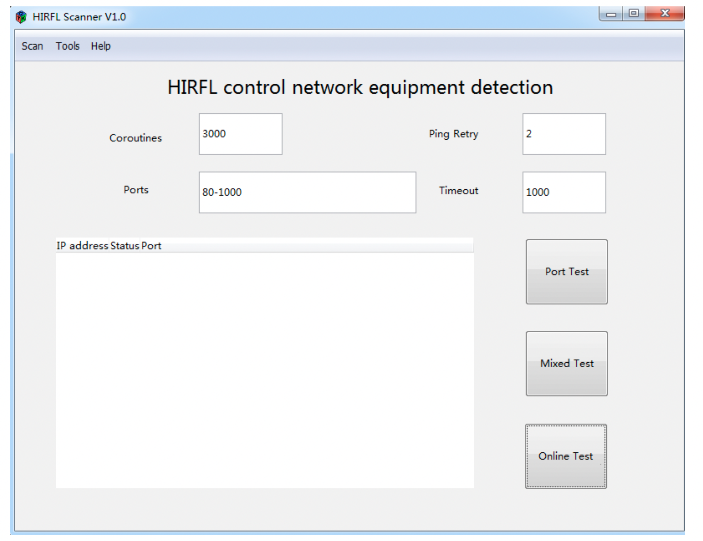

# Port Scanner:

### System Architecture:

### GUI:

  * Break the GUI into 3 submodules:
    * Parameter input module:
      * Parameters:
        * Coroutines
        * Ports (to ping)
        * Ping Retry
        * Timeout in ms

    * Function module (core of this system):
      * The user can complete the task of scanning via these below functions:
        * IP address online scanning
        * port scanning
        * mixed scanning (ip + port scanning)

    * Results output Module:
      * When the system in scanning results will display here in real time
      * After the scan has completed the results of the scan will be displayed
      via a dialog box.

### Port Scanning:
* Once you have determined the range then it is necessary to configure the port scanner to the depth you want to scan the ports and IP addresses on a network.
There are different levels of port scanning that include light port scanning to a heavy port scan.
  * Basic Port Scan: This the easiest type of port scan which involves scanning a designated port by sending a specifically configured packet that contains
  the port number of the port that is to be scanned. This technique is used to determine which port is available within a specific machine.

  * TCP Connect: A TCP connect is used to scan a series of ports on a machine to determine port availability. If a port on the machine is listening then the
  TCP connect is successful in reaching that specific port.

  * Strobe Scan: This type of scan is generally used by a hacker to find the ports that the hacker already knows how to exploit. A strobe scan performs
   scanning on a more constricted level and also allows for disclosure of the username of the TCP connection.

  * Stealth Scan: This type of scan is specifically designed for hacking because it is set up to go undetected by network auditing tools.
    When a port scanner is used, the ports that are listening will log an error message if an inbound connection is detected but there is no
    data associated with the connection. Stealth scans are able to bypass this process and therefore go undetected during audits.

### Packages:
* Golang Packages:
  * Note: The original architecture was designed in golang so will need to find python equivalents
  * The main program is developed with go1.13.4, and the core packages are:
        * Package net provides a portable interface for network I/O, including TCP/IP, UDP, domain name resolution, and Unix domain sockets.
        * We use the DialTimeout method in the net package to receive the protocol, IP address, port number, and the timeout period.
        * Package sync provides basic synchronization primitives such as mutual exclusion locks.
        * Mutex is used to solve the problem of data competition
        * WaitGroup solves the problem of coroutine synchronization.
        * Package icmp provides basic functions for the manipulation of messages used in the Internet Control Message
            Protocols, ICMPv4 and ICMPv6.
        * The ipv4 package is used to implement the IP level socket option. The ipv4 package is used to implement the IP level socket option for the Internet Protocol
          version 4. Other packages used in the development of HIRFL Scanner include bufio, os, errors, fmt,
          time.
  * Python Packages:
    * [ping3 4.0.3](https://pypi.org/project/ping3/)
    * [netaddr 0.8.0](https://pypi.org/project/netaddr/)
    * [naddrtools .1.2](https://pypi.org/project/naddrtools/)
    * [pytricia](https://pypi.org/project/pytricia/)
    * [ipv6](https://pypi.org/project/ipv6/)
    * [asyncio]()

### Resources:
[Network Scanner 101](https://www.bestproxyreviews.com/network-scanner/)

### Tasks:
* Experiment:
  * Ping a port on local network

